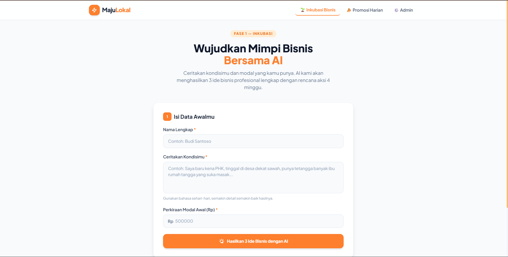
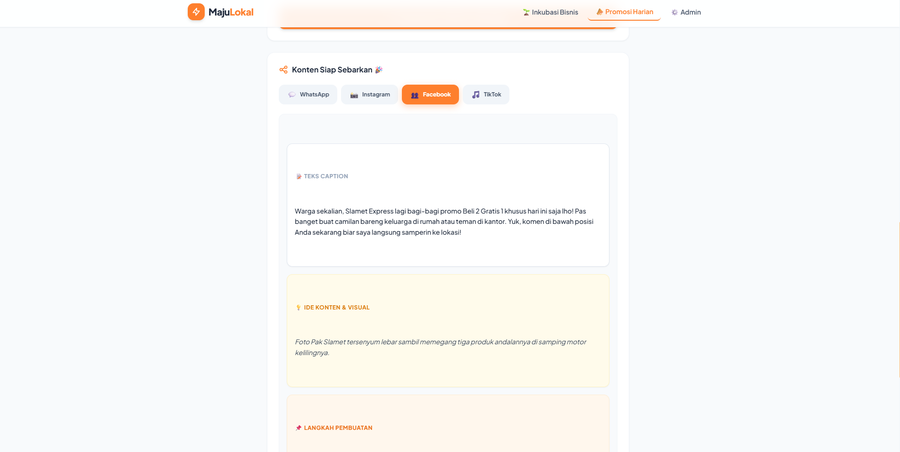
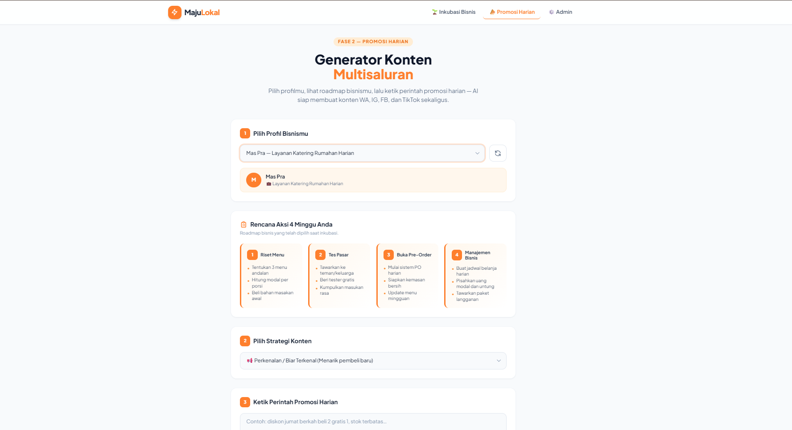
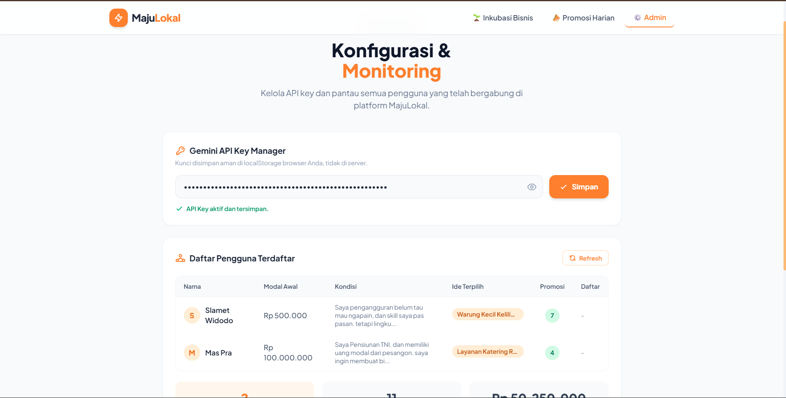

<div align="center"> 

# ⚡ MajuLokal
### Platform Inkubasi Bisnis & Generasi Promosi Harian UMKM Berbasis AI

**Solusi digital berbasis kecerdasan buatan (AI) untuk membantu calon wirausaha, korban PHK, dan UMKM lokal merancang ide bisnis dari nol serta menghasilkan konten promosi 4 platform sekaligus secara otomatis.**

[](https://maju-lokal.vercel.app/)
[](https://supabase.com)
[](https://ai.google.dev/)
[](https://vercel.com)
</div>

---

## 📌 Tentang MajuLokal

**MajuLokal** adalah platform inklusi ekonomi berbasis AI yang dirancang untuk membimbing masyarakat umum dan pelaku UMKM dalam memulai serta mengandalkan bisnis secara mandiri. Melalui integrasi kecerdasan buatan **Google Gemini API**, MajuLokal memangkas kerumitan dalam membuat perencanaan bisnis (business plan) dan pembuatan konten pemasaran harian.

> Mengubah modal minim dan kondisi latar belakang pengguna menjadi rencana aksi bisnis yang konkret serta strategi pemasaran digital yang siap pakai dalam hitungan detik.

---

## ✨ Fitur Utama

### 🌱 **Inkubasi Bisnis 4 Minggu (Fase 1 - 3)**:
  - **Fase 1: Eksplorasi Ide Bisnis** — Memproses latar belakang pengguna dan modal awal untuk merumuskan 3 opsi ide bisnis yang paling rasional.
  - **Fase 2: Rencana Aksi 4 Minggu** — Menyusun langkah operasional terstruktur minggu demi minggu yang mudah dieksekusi oleh orang awam.
  - **Fase 3: Analisis Modal & Keuangan** — Mengkalkulasi alokasi modal awal, estimasi harga jual, dan target Break Even Point (BEP).
### 📣 **Generator Promosi Harian (4-in-1 Multi-Platform)**:
  - Menghasilkan caption promosi, ide visual (foto/video), dan petunjuk instruksi pembuatan konten yang dipersonalisasi khusus untuk **WhatsApp, Instagram, Facebook, dan TikTok** sekaligus.
  - Teks caption dibuat ringkas, komunikatif, ramah pemula, dan siap disalin dalam satu klik.
### ⚙️ **Panel Admin & Manajemen Database**:
  - Menyimpan riwayat inkubasi dan ide promosi harian ke database Supabase secara *real-time*.
  - Menyediakan ringkasan statistik penggunaan platform dan manajemen konfigurasi sistem.

---

## 🖥️ Screenshot Aplikasi

| Form Inkubasi Bisnis | Generasi Ide Bisnis AI |
|---|---|
|  |  |

| Generator Konten Promosi | Admin Dashboard |
|---|---|
|  |  |

---

## 🛠️ Tech Stack

| Teknologi | Kegunaan |
|---|---|
| **HTML5, CSS3, JavaScript (ES6+)** | Antarmuka pengguna (UI) responsif, bersih, dan cepat tanpa berat *framework* |
| [Supabase](https://supabase.com) | Database PostgreSQL & backend service untuk menyimpan data inkubasi dan promosi |
| [Google Gemini API](https://ai.google.dev/) | Engine AI utama untuk analisis ide bisnis dan pembuatan konten promosi |
| **AntiGravity IDE** | Lingkungan pengembangan aplikasi (*Development Environment*) |
| [Vercel](https://vercel.com) | Cloud deployment & hosting platform |

---

## 🗄️ Setup Database & Skema Supabase

Gunakan skema SQL berikut pada **SQL Editor** di dashboard Supabase Anda untuk menyiapkan tabel penyimpanan data:

```sql
-- 1. Tabel Profil & Data Inkubasi Pengguna
CREATE TABLE public.users_bisnis (
  id bigint NOT NULL DEFAULT nextval('users_bisnis_id_seq'::regclass),
  nama_user character varying NOT NULL,
  kondisi_lingkungan text NOT NULL,
  modal_awal numeric NOT NULL,
  ide_bisnis_terpilih character varying NOT NULL,
  roadmap_4_minggu jsonb,
  created_at timestamp with time zone DEFAULT timezone('utc'::text, now()),
  CONSTRAINT users_bisnis_pkey PRIMARY KEY (id)
);

-- 2. Tabel Generator Promosi Harian (Multi-Platform)
CREATE TABLE public.promosi_harian (
  id bigint NOT NULL DEFAULT nextval('promosi_harian_id_seq'::regclass),
  user_id bigint,
  perintah_harian text NOT NULL,
  promosi_whatsapp text,
  promosi_instagram text,
  promosi_facebook text,
  promosi_tiktok text,
  tipe_konten text,
  created_at timestamp with time zone DEFAULT timezone('utc'::text, now()),
  CONSTRAINT promosi_harian_pkey PRIMARY KEY (id),
  CONSTRAINT fk_promosi_user FOREIGN KEY (user_id) REFERENCES public.users_bisnis(id)
);

-- 3. Tabel Kredensial Administrator
CREATE TABLE public.admin_accounts (
  id bigint NOT NULL,
  username character varying NOT NULL,
  password_plain text NOT NULL,
  created_at timestamp with time zone DEFAULT timezone('utc'::text, now()),
  CONSTRAINT admin_accounts_pkey PRIMARY KEY (id)
);
```
---
## 🕹️ Alur Penggunaan Aplikasi
### 1. Program Inkubasi Bisnis
1. Buka menu Inkubasi Bisnis.
2. Masukkan Nama Lengkap, Ceritakan Kondisimu, dan Perkiraan Modal Awal (Rp).
3. Klik Hasilkan 3 Ide Bisnis dengan AI.
4. Pilih salah satu ide bisnis favorit, lalu klik Lanjutkan ke Rencana Aksi 4 Minggu.

### 2. Promosi Harian 
1. Buka menu Promosi Harian.
2. Pilih Profil Bisnis yang sudah dibuat (Roadmap aksi 4 minggu akan otomatis muncul sebagai referensi). 
3. Pilih Strategi Konten yang ingin digunakan (contoh: Perkenalan / Biar Terkenal).
4. Ketik Perintah Promosi Harian (contoh: "diskon jumat berkah beli 2 gratis 1, stok terbatas").
5. Klik Buat Konten 4 Platform Sekaligus.
6. Pilih tab sosial media yang diinginkan (WhatsApp / Instagram / Facebook / TikTok) dan klik Salin Konten Aktif untuk siap posting!

### 3. Panel Admin & Konfigurasi Sistem
1. Buka menu **Admin** pada bilah navigasi kanan atas.
2. Masukkan kredensial akun demo untuk login:
   - **Username**: `demouser`
   - **Password**: `demo12345`
3. Setelah berhasil masuk ke **Admin Panel (Konfigurasi & Monitoring)**, Anda dapat mengakses fitur-fitur berikut:
   - **Gemini API Key Manager** — Mengelola dan menyimpan API Key Google Gemini secara aman di *localStorage* browser.
   - **Daftar Pengguna Terdaftar** — Memantau daftar pelaku UMKM yang telah bergabung, rincian modal awal, kondisi lingkungan, ide bisnis terpilih, serta jumlah konten promosi yang telah dihasilkan.
   - **Metrik & Ringkasan Statistik** — Melihat ringkasan data secara *real-time* meliputi **Total Pengguna**, **Total Konten Dibuat**, dan **Rata-rata Modal** seluruh UMKM.
---

## 🚀 Cara Menjalankan Secara Lokal
### 1. Clone Repository
```
Bash
git clone [https://github.com/Zoyyyyyyy/MajuLokal.git](https://github.com/Zoyyyyyyy/MajuLokal.git)
cd MajuLokal
```

### 2. Konfigurasi Database & API Key
Buka file src/js/supabase.js dan src/js/ai.js, lalu sesuaikan kredensial berikut:
```
JavaScript
// src/js/supabase.js
const SUPABASE_URL = '[https://ksbjkgcorfmdabneaoyl.supabase.co](https://ksbjkgcorfmdabneaoyl.supabase.co)';
const SUPABASE_ANON_KEY = 'YOUR_SUPABASE_ANON_KEY';
```

### 3. Jalankan Aplikasi
Jalankan file index.html menggunakan ekstensi Live Server di IDE pilihan Anda (seperti VS Code atau AntiGravity IDE).
```
📁 Struktur Project
MajuLokal/
├── index.html          # Halaman utama (SPA Routing: Inkubasi, Promosi, Admin)
└── src/                # Folder source code & aset utama
    ├── js/
    │   ├── app.js      # Controller utama & navigasi aplikasi
    │   ├── ai.js       # Integrasi Google Gemini API (Prompt & Auto-repair Parser)
    │   ├── ui.js       # Renderer komponen UI & manajemen modal/loading
    │   └── supabase.js # Inisialisasi client & query database Supabase
    └── img/            # Direktori gambar dokumentasi README
        ├── inkubasi.png
        ├── fitur_ai.png
        ├── generator_konten.png
        └── admin_page.png
```

