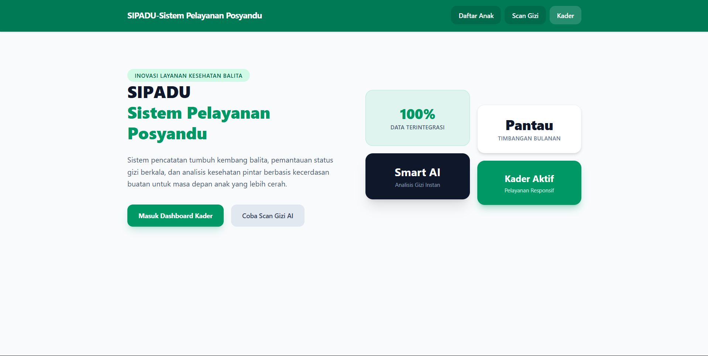
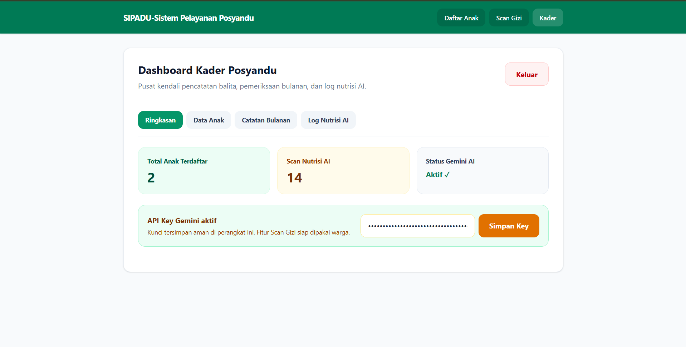
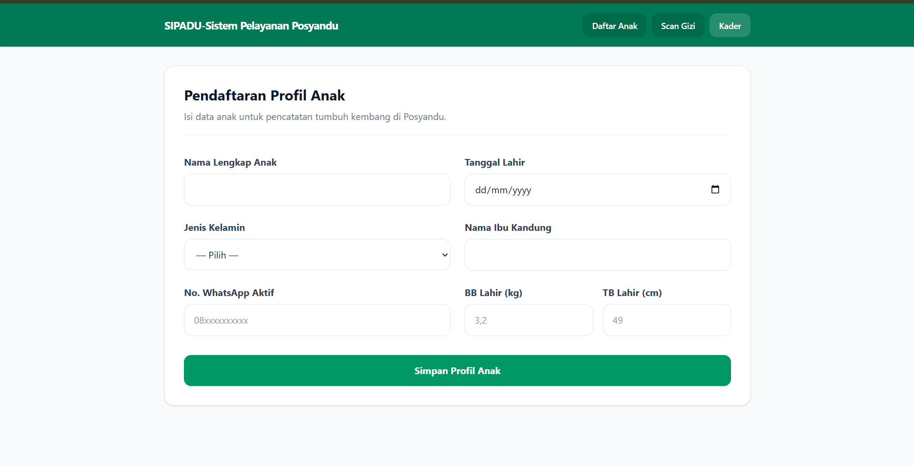
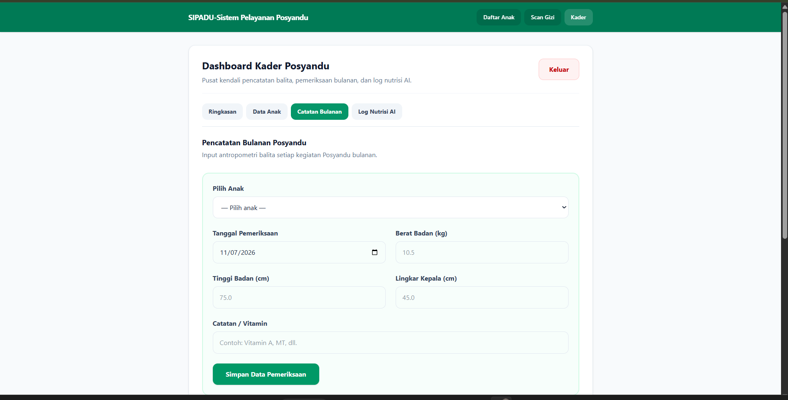
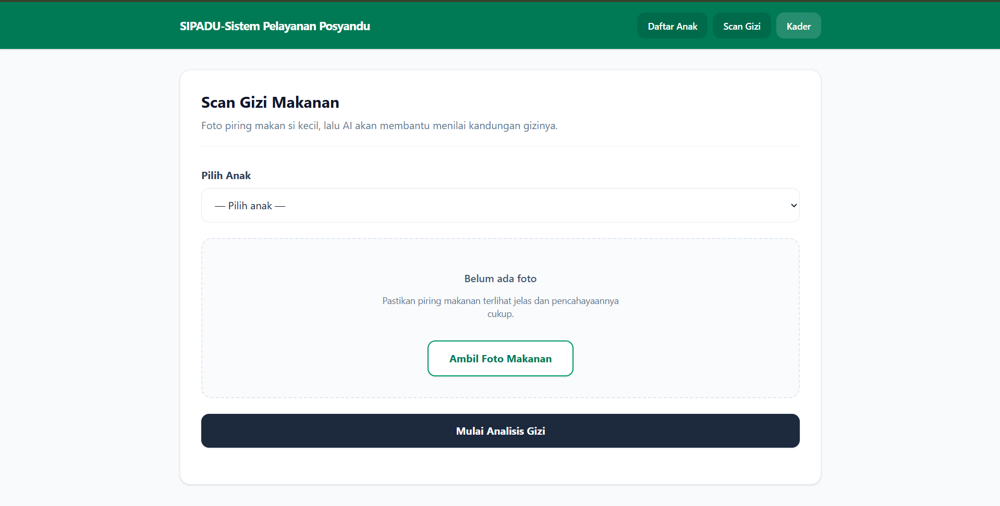
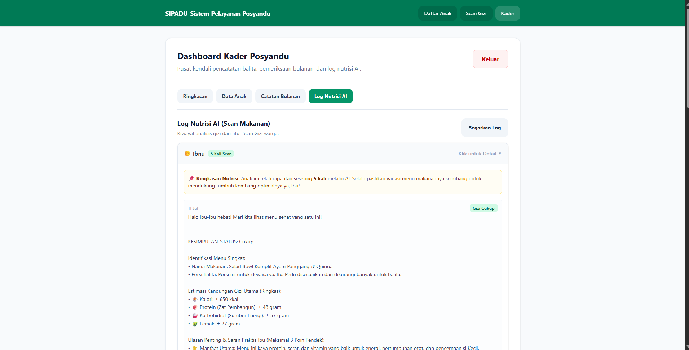

<div align="center">

# 👶 Web Posyandu Modern
### AI Food Nutrition Scanner & Digital Health Recording

**Sistem informasi manajemen Posyandu digital berbasis AI untuk mempermudah kader dan memantau tumbuh kembang serta nutrisi anak.**

[](https://project-posyandu.vercel.app/)
[](https://supabase.com)
[](https://ai.google.dev/)
[](https://vercel.com)

</div>

---

## 📌 Tentang Web Posyandu

**Web Posyandu** adalah aplikasi berbasis digital yang dirancang khusus untuk mempermudah kader dalam mendata tumbuh kembang anak secara bulanan, sekaligus membantu orang tua memantau kecukupan nutrisi makanan harian anak secara instan menggunakan kecerdasan buatan (AI).

> Mengubah pencatatan buku posyandu konvensional menjadi serba digital, aman, dan interaktif bagi masyarakat.

---

## ✨ Fitur Utama

- 🏠 **Landing Page Informatif** — Halaman utama interaktif yang memuat informasi menyeluruh dari fitur-fitur web.
- 📝 **Daftar Anak Digital** — Pendataan identitas lengkap anak (Nama, Tgl Lahir, Gender, Ibu Kandung, WhatsApp, BB, TB) terintegrasi langsung ke database.
- 🤖 **AI Nutrition Scanner** — Cukup pilih nama anak via dropdown dan upload foto makanan harian, AI akan langsung menjabarkan info nutrisinya secara detail.
- 🔐 **Secure Admin Dashboard (Kader)** — Dashboard khusus kader dilindungi sistem login database untuk memantau total anak, jumlah scan, status AI, serta input API key Gemini secara dinamis.
- 📈 **Catatan Bulanan & Log Nutrisi** — Input berkala tumbuh kembang anak (BB, TB, Lingkar Kepala) serta log riwayat scan makanan agar kader bisa memantau pola makan anak sehari-hari.

---

## 🖥️ Screenshot Aplikasi

| Landing Page / Dashboard Utama | Dashboard Admin (Kader) |
|---|---|
|  |  |

| Pendaftaran Anak | Pencatatan Bulanan |
|---|---|
|  |  |

| Scanner Makanan AI | Log Riwayat Nutrisi |
|---|---|
|  |  |

---

## 🛠️ Tech Stack

| Teknologi | Kegunaan |
|---|---|
| **HTML5 & CSS3** | Struktur web & manajemen tampilan UI (Modular Styling) |
| [Supabase](https://supabase.com) | Database PostgreSQL untuk data anak, catatan bulanan, dan secure akun admin |
| [Google Gemini API](https://ai.google.dev/) | Engine AI untuk melakukan scanning nutrisi makanan dari foto |
| **AntiGravity IDE** | Lingkungan pengembangan (*Development Environment*) |
| [Vercel](https://vercel.com) | Hosting & cloud deployment |

---

## 🗄️ Setup Database & Skema Supabase

Gunakan skema SQL di bawah ini pada **SQL Editor** Supabase untuk mereplikasi struktur database yang digunakan pada aplikasi ini:

```sql
-- 1. Tabel Utama Data Anak
create table anak (
  id uuid default gen_random_uuid() primary key,
  user_id uuid null,
  nama_anak varchar not null,
  tanggal_lahir date not null,
  jenis_kelamin bpchar not null,
  nama_ibu varchar not null,
  no_hp varchar not null,
  bb_lahir numeric null,
  tb_lahir numeric null,
  created_at timestamp with time zone default timezone('utc'::text, now()) not null
);

-- 2. Tabel Catatan Timbangan Bulanan Posyandu
create table timbangan_bulanan (
  id uuid default gen_random_uuid() primary key,
  anak_id uuid references anak(id) on delete cascade not null,
  berat_badan numeric not null,
  tinggi_badan numeric not null,
  lingkar_kepala numeric null,
  bulan_ke int4 not null,
  catatan_kader text null,
  tanggal_timbang date not null
);

-- 3. Tabel Log Harian Nutrisi Hasil Scan AI
create table harian_nutrisi (
  id uuid default gen_random_uuid() primary key,
  anak_id uuid references anak(id) on delete cascade not null,
  foto_url text null,
  analisis_ai text not null,
  status_gizi_hari_ini varchar null,
  tanggal_scan date not null
);

-- 4. Tabel Kredensial Akun Admin (Kader)
create table admin_accounts (
  id bigint generated always as identity primary key,
  username text unique not null,
  password text not null,
  created_at timestamp with time zone default timezone('utc'::text, now()) not null
);

-- Insert Akun Default Kader untuk Login Awal
insert into admin_accounts (username, password) 
values ('kaderposyandu', 'posyandu2026');
```

## 🕹️ Alur Penggunaan & Demo Aplikasi

Untuk mempermudah pengujian, berikut adalah alur kerja (workflow) penggunaan Web Posyandu dari sisi Pengguna (Orang Tua) dan Admin (Kader):

### 👥 1. Sisi Pengguna (Orang Tua / Umum)
1. **Akses Landing Page:** Pengguna membuka website dan dapat melihat informasi layanan Posyandu digital yang tersedia.
2. **Pendaftaran Anak:**
   - Masuk ke menu **Daftar Anak**.
   - Isi data identitas anak secara lengkap (Nama, Tanggal Lahir, Jenis Kelamin, Nama Ibu, No. WhatsApp, serta BB & TB Awal).
   - Klik Simpan. Data akan otomatis masuk ke tabel `anak` di Supabase secara *real-time*.
3. **Scan Nutrisi Makanan (AI):**
   - Masuk ke menu **Scan Gizi Makanan**.
   - Pilih nama anak yang sudah terdaftar sebelumnya pada kolom *dropdown*.
   - *Upload* atau ambil foto makanan harian anak.
   - Klik proses, dan sistem (via Gemini API) akan langsung menampilkan analisis detail mengenai kandungan nutrisi makanan tersebut. Riwayat scan ini otomatis tercatat di tabel `harian_nutrisi`.

### 🔐 2. Sisi Admin (Kader Posyandu)
1. **Login Kader:**
   - Masuk ke halaman khusus admin.
   - Masukkan *Username* dan *Password* yang terdaftar pada tabel `admin_accounts` di database.
   - Untuk Live Demo Gunakan : Username (adminKader) Password (passwordPosyandu123)
2. **Dashboard Ringkasan:** Setelah sukses login, kader disuguhkan ringkasan berupa:
   - Total anak yang terdaftar di sistem.
   - Total akumulasi scan nutrisi AI yang telah dilakukan oleh user.
   - Status keaktifan sistem AI serta kolom input untuk memperbarui API Key Gemini secara dinamis.
3. **Pencatatan Posyandu Bulanan:**
   - Masuk ke menu **Catatan Bulanan**.
   - Pilih nama anak dari *dropdown* data yang terintegrasi.
   - Input hasil pemeriksaan fisik berkala (Berat Badan, Tinggi Badan, Lingkar Kepala, Bulan Ke-, serta Catatan Tambahan Khusus). Data akan tersimpan di tabel `timbangan_bulanan`.
4. **Monitoring Log Nutrisi:**
   - Kader dapat membuka menu **Log Nutrisi AI** untuk melihat rekapitulasi makanan apa saja yang dikonsumsi oleh anak sehari-hari berdasarkan foto yang di-scan oleh orang tua. Ini mempermudah kader dalam memberikan evaluasi gizi yang tepat sasaran.

## 🚀 Cara Menjalankan Lokal
1. Clone Repository
```
Bash
git clone https://github.com/Zoyyyyyyy/Project-Magang/tree/main/SIPADU
cd project-posyandu
```
3. Konfigurasi Kredensial Supabase
Buka file src/supabase.js dan pastikan konfigurasi client sudah mengarah ke proyek Supabase kamu:
```
JavaScript
const supabaseUrl = '[https://xxxxxxxx.supabase.co](https://xxxxxxxx.supabase.co)'
const supabaseKey = 'eyJxxxxxxxxxxxxxxxxxxxxxxxx'
```
4. Jalankan Aplikasi
Buka index.html menggunakan fitur Live Server di IDE kamu.
---
## 📁 Struktur Project
Struktur folder dikembangkan menggunakan standar modular industri profesional:

```
project-posyandu/
├── index.html          # Halaman utama & routing SPA (Single Page Application)
└── src/                # Folder source code utama
    ├── styles.css      # Seluruh manajemen style & UI
    ├── supabase.js     # Inisialisasi client & query database Supabase
    ├── ai.js           # Integrasi & logika hit API Google Gemini
    ├── admin.js        # Logika dashboard, pencatatan bulanan, & auth kader
    └── img/            # Penyimpanan aset gambar & dokumentasi web
        ├── catatan_bulanan.png
        ├── daftar_anak.png
        ├── dashboard.png
        ├── dashboard_admin.png
        ├── data_anak.png
        ├── log_nutrisi_ai.png
        └── scan_ai.png
```
---

<div align="center">
Dibuat dengan ❤️ untuk kemajuan Kesehatan Anak Indonesia

⭐ Beri bintang pada repository ini jika bermanfaat!
</div>
