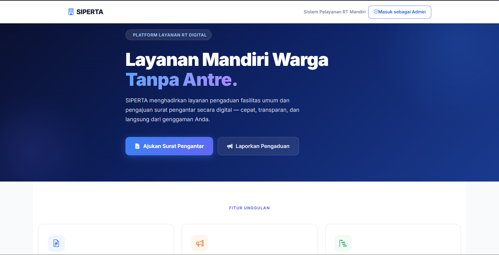
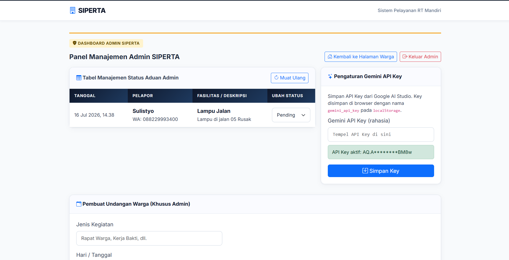
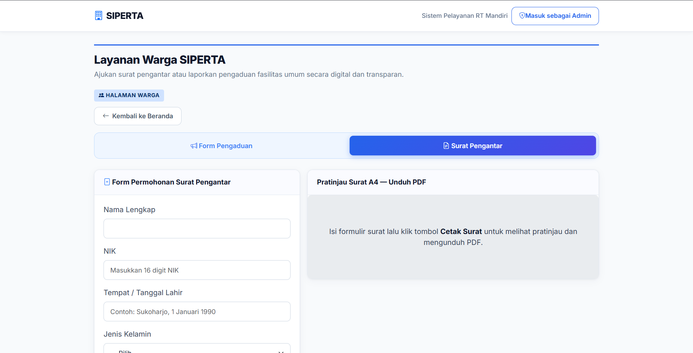
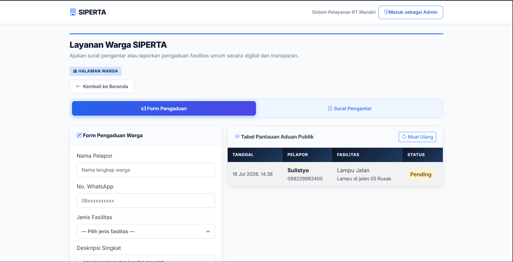

<div align="center"> 

# 🏢 Web SIPERTA (Sistem Pelayanan RT Mandiri)
### AI Document Formatter & Digital Complaint Management

**Sistem informasi pelayanan administrasi mandiri tingkat Rukun Terrangga berbasis AI untuk mempermudah warga dalam membuat surat pengantar secara instan dan melaporkan pengaduan fasilitas secara transparan.**

[](https://siperta.vercel.app/)
[](https://supabase.com)
[](https://ai.google.dev/)
[](https://vercel.com)
</div>

---

## 📌 Tentang SIPERTA

**SIPERTA** adalah aplikasi pelayanan mandiri tingkat RT yang dirancang khusus untuk membantu warga dalam mengurus surat pengantar dan dokumen administratif secara mandiri kapan saja, tanpa harus menunggu kehadiran fisik Ketua RT. Selain itu, platform ini menyediakan ruang transparansi bagi warga untuk mengadukan kerusakan fasilitas umum di lingkungan sekitar.

> Mengubah birokrasi konvensional di tingkat Rukun Tetangga menjadi serba digital, cepat, aman, dan to-the-point menggunakan optimasi kecerdasan buatan (AI).

---

## ✨ Fitur Utama

- 🏠 **Landing Page Modern & Profesional** — Halaman utama interaktif antarmuka non-AI slop yang memuat ringkasan fitur, CTA cepat, dan navigasi ramah pengguna.
- 📝 **Pembuat Surat Pengantar Mandiri** — Warga mengisi formulir identitas kependudukan dasar (Nama, NIK, TTL, Agama, Pekerjaan, dll) beserta detail keperluan surat.
- 🤖 **AI Keperluan Formatter (To-The-Point)** — Didukung oleh Google Gemini API. Teks keperluan berbahasa sehari-hari dari warga otomatis dikonversi oleh AI menjadi satu kalimat resmi yang baku dan langsung menggantikan teks awal secara otomatis tanpa basa-basi chat.
- 📢 **Form Pengaduan Fasilitas Publik** — Wadah bagi warga untuk melaporkan kerusakan fasilitas RT (Nama Pelapor, No. WA, Jenis Fasilitas Dropdown, dan Deskripsi). Laporan yang masuk disajikan di tabel pemantauan publik secara *real-time*.
- 🔐 **Secure Admin Dashboard (Ketua RT)** — Ruang kendali khusus Ketua RT yang dilindungi oleh autentikasi database untuk memantau status aduan warga, pembuat undangan warga berbasis AI (dilengkapi AI format agenda otomatis), dan menu konfigurasi API Key Gemini.
- 📄 **Cetak & Download PDF** — Surat pengantar dan undangan warga yang telah dibuat dapat dicetak langsung atau diunduh secara manual dalam format berkas dokumen siap pakai.

---

## 🖥️ Screenshot Aplikasi

| Landing Page / Dashboard Utama | Dashboard Admin (Ketua RT) |
|---|---|
|  |  |

| Formulir Pembuatan Surat Pengantar | Formulir Pengaduan Fasilitas |
|---|---|
|  |  |

---

## 🛠️ Tech Stack

| Teknologi | Kegunaan |
|---|---|
| **HTML5 & CSS3** | Struktur web & manajemen tampilan UI (Professional SaaS Look) |
| [Supabase](https://supabase.com) | Database PostgreSQL untuk data pengaduan, arsip surat, kustom RLS, dan keamanan akun admin |
| [Google Gemini API](https://ai.google.dev/) | Engine AI untuk memformat teks keperluan surat dan susunan agenda acara undangan warga |
| **AntiGravity IDE** | Lingkungan pengembangan aplikasi (*Development Environment*) |
| [Vercel](https://vercel.com) | Media hosting & cloud deployment untuk rilis produksi |

---

## 🗄️ Setup Database & Skema Supabase

Gunakan skema SQL di bawah ini pada **SQL Editor** di dashboard Supabase Anda untuk mereplikasi struktur tabel yang digunakan pada aplikasi ini:

```sql
-- 1. Tabel Form Pengaduan Warga
create table pengaduan (
  id int8 generated by default as identity primary key,
  created_at timestamp with time zone default timezone('utc'::text, now()) not null,
  nama_pelapor text not null,
  no_wa text not null,
  jenis_fasilitas text not null,
  deskripsi text not null,
  status text default 'Diproses'::text not null
);

-- 2. Tabel Arsip Surat Pengantar Warga
create table arsip_surat (
  id int8 generated by default as identity primary key,
  created_at timestamp with time zone default timezone('utc'::text, now()) not null,
  nik text not null,
  nama_warga text not null,
  jenis_surat text not null,
  keperluannya text not null
);

-- 3. Tabel Kredensial & Konfigurasi Kunci Admin (RT)
create table admin_config (
  id int4 generated by default as identity primary key,
  key varchar not null unique,
  value text not null
);

-- Memasukkan password akun admin utama dan akun untuk live demo
insert into admin_config (key, value) 
values 
  ('admin_password', 'xxxxxxxxx'),
  ('demo_password', 'DemoWarga123');
Catatan Keamanan (RLS): Pastikan Anda telah mengaktifkan Row Level Security (RLS) pada tabel arsip_surat dan admin_config guna melindungi data NIK warga dan kredensial password admin agar tidak disalahgunakan dari publik di sisi frontend.
```

### 🕹️ Alur Penggunaan & Demo Aplikasi
Berikut adalah alur kerja (workflow) operasional penggunaan sistem informasi layanan SIPERTA:

### 👥 1. Sisi Pengguna (Warga Umum)
### 1. Akses Landing Page: Pengguna membuka website dan disambut oleh dashboard layanan mandiri yang modern. Warga dapat memilih opsi navigasi utama melalui tombol CTA.

Membuat Surat Pengantar:

### 2. Masuk ke menu Surat Pengantar.
- Isi formulir identitas kependudukan lengkap Anda.
- Pada kolom Keperluan Detail, ketik alasan Anda menggunakan bahasa sehari-hari.
- Klik tombol ✨ Format dengan AI. Sistem otomatis memformat teks tersebut menjadi kalimat baku resmi dan langsung menggantikan teks input awal.
- Klik Cetak Surat atau Download PDF Manual untuk mengunduh dokumen fisik.
  
### 3. Mengirim Laporan Pengaduan:
- Masuk ke menu Form Pengaduan.
- Isi Nama Pelapor, Nomor WhatsApp aktif, jenis fasilitas, dan deskripsi singkat masalah.
- Klik kirim. Riwayat aduan Anda akan masuk ke Tabel Pantauan Aduan Publik dengan status awal "Diproses".

### 🔐 2. Sisi Admin (Ketua RT)
### 1. Login Administrator / Live Demo:
- Klik tombol Masuk sebagai Admin di pojok kanan atas halaman.
- Masukkan kata sandi akses pengujian untuk live demo (DemoWarga123).
  
### 2. Manajemen Laporan Pengaduan:
- Ketua RT dapat memantau seluruh keluhan fasilitas yang dikirimkan oleh warga secara real-time.
- Mengubah status penanganan aduan (misal dari "Diproses" menjadi "Selesai") setelah perbaikan fasilitas selesai dilakukan.
  
### 3. Pembuat Undangan Warga (AI Agenda):
- Masuk ke menu pembuatan undangan kegiatan warga.
- Ketik poin agenda kotor di kolom acara, lalu klik ✨ Format dengan AI untuk menyusun susunan acara resmi secara otomatis dengan struktur penomoran yang rapi.
- Klik Cetak Surat Undangan untuk mengarsipkan ke database dan mengunduh berkas fisik siap edar.

### 🚀 Cara Menjalankan Lokal
### 1 . Clone Repository
```
Bash
git clone [https://github.com/Zoyyyyyyy/Project-Magang/tree/main/SIPERTA](https://github.com/Zoyyyyyyy/Project-Magang/tree/main/SIPERTA)
cd SIPERTA
```
Konfigurasi Kredensial Supabase & API
Buka file inisialisasi source code database Anda (misal src/supabase.js) dan sesuaikan parameter URL beserta Kunci API Anonim Anda:
```
JavaScript
const supabaseUrl = '[https://xxxxxxxxxxxxxxxxxxxx.supabase.co](https://xxxxxxxxxxxxxxxxxxxx.supabase.co)'
const supabaseKey = 'eyxxxxxxxxxxxxxxxxxxxxxxxxxxxxxxxxxxx...'
```
Jalankan Aplikasi
Jalankan file index.html menggunakan ekstensi Live Server di IDE pilihan Anda (seperti VS Code atau lingkungan kerja AntiGravity).

### 2. 📁 Struktur Project
Penyusunan folder dikembangkan menggunakan arsitektur bersih berstandar industri:
```
SIPERTA/
├── index.html          # Halaman gerbang utama (Landing Page) & SPA Routing
└── src/                # Folder source code & aset utama
    ├── styles.css      # Seluruh konfigurasi gaya UI modern (SaaS layout, Anti-AI Slop)
    ├── supabase.js     # Inisialisasi client, penanganan RLS, & query data Supabase
    ├── ai.js           # Integrasi kontrol internal prompt Google Gemini API
    ├── admin.js        # Manajemen panel admin, perubahan status aduan, & auth kustom
    └── img/            # Direktori penyimpanan aset visual dokumentasi aplikasi
        ├── dashboard.png
        ├── halamanadmin.png
        ├── menu_formpembuatansurat.png
        └── menu_formpengajuan.png
```
<div align="center">
⭐ Beri bintang pada repository ini jika proyek ini membantu Anda!
</div>
